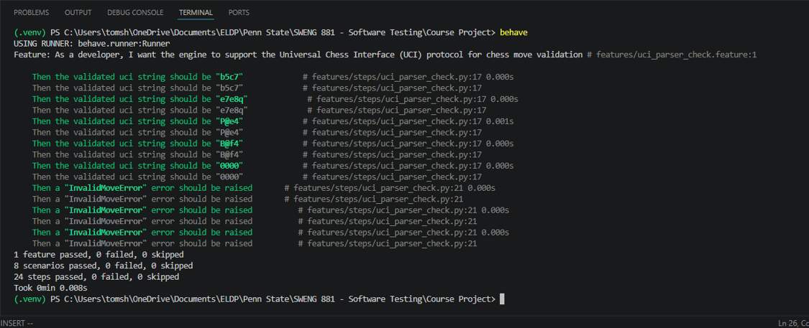
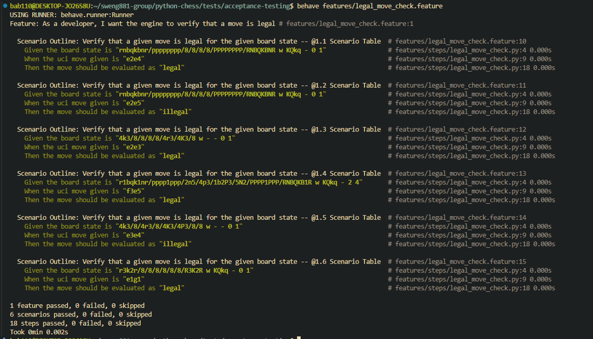
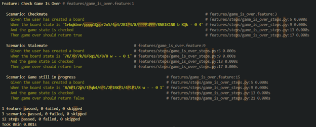

### 5.2.4 Acceptance Testing

#### **5.2.4.1 UCI Parser Acceptance Test Cases**

**User Story**
**As a** developer 
**I want** the chess engine to support the Universal Chess Interface (UCI) protocol 
**So that** move validation is standardized and communication with third party chess tools is possible 

**Acceptance Criteria** 
Based on this user story, the following acceptance criteria were determined:
- Valid uci move strings should return as valid when checked using the from_uci() method
    - Note: move validity is board state dependent, so the current board state should be accounted for using the board.legal_moves() method
- Invalid uci move string should return “InvalidMoveError” when checked using the from_uci() method

**Scenario ACC-UP-01:** The parser is provided the valid uci string: “b5c7” 
**Given** the engine is waiting for a uci move string 
**When** the given uci string is “b5c7” 
**Then** the validated uci string should be “b5c7” 

**Scenario ACC-UP-02:** The parser is provided the valid uci string: “e7e8q” 
**Given** the engine is waiting for a uci move string 
**When** the given uci string is “e7e8q” 
**Then** the validated uci string should be “e7e8q” 

**Scenario ACC-UP-03:** The parser is provided the valid uci string: “P@e4” 
**Given** the engine is waiting for a uci move string 
**When** the given uci string is “P@e4” 
**Then** the validated uci string should be “P@e4” 

**Scenario ACC-UP-04:** The parser is provided the valid uci string: “B@f4” 
**Given** the engine is waiting for a uci move string 
**When** the given uci string is “B@f4” 
**Then** the validated uci string should be “B@f4” 

**Scenario ACC-UP-05:** The parser is provided the valid uci string: “0000” 
**Given** the engine is waiting for a uci move string 
**When** the given uci string is “0000” 
**Then** the validated uci string should be “0000” 

**Scenario ACC-UP-06:** The parser is fed the invalid uci string: “N” 
**Given** the engine is waiting for a uci move string 
**When** the given uci string is “N” 
**Then** a “InvalidMoveError” error should be raised 

**Scenario ACC-UP-07:** The parser is fed the invalid uci string: “zig3” 
**Given** the engine is waiting for a uci move string 
**When** the given uci string is “zig3” 
**Then** a “InvalidMoveError” error should be raised 

**Scenario ACC-UP-08:** The parser is fed the invalid uci string: “Q@g9” 
**Given** the engine is waiting for a uci move string 
**When** the given uci string is “Q@g9” 
**Then** a “InvalidMoveError” error should be raised 

**Test Results**  

#### **5.2.4.2 Legal Move Validation Acceptance Test Cases**

**User Story**
**As a** developer 
**I want** the chess engine to verify that a move is legal for the current board state 
**So that** move legality is enforced in games where strict rule enforcement is desired by the user 

**Acceptance Criteria** 
Based on this user story, the following acceptance criteria were determined:
- Given an FEN string of a particular board state and a desired UCI string representing a move, the engine should be able to verify if the resulting board state following the move is legal or not.
    - This verification should take place given a valid or invalid UCI string
    - This verification should take into account the current and future board state when determining move legality

**Scenario ACC-LM-01 to ACC-LM-06**: Verify that a given move is legal for the given board state 
**Given** the board state is “<board_FEN>” 
**When** the uci move given is “<uci_string>” 
**Then** the move should be evaluated as “<legality>” 
	
**Examples: Scenario Table**

| board_FEN | uci_string | legality |
| --------- | ---------- | -------- |
| rnbqkbnr/pppppppp/8/8/8/8/PPPPPPPP/RNBQKBNR w KQkq - 0 1 | e2e4 | legal | 
| rnbqkbnr/pppppppp/8/8/8/8/PPPPPPPP/RNBQKBNR w KQkq - 0 1 | e2e5 | illegal | 
| 4k3/8/8/8/8/4r3/4K3/8 w - - 0 1 | e2e3 | legal | 
| r1bqk1nr/pppp1ppp/2n5/4p3/1b2P3/5N2/PPPP1PPP/RNBQKB1R w KQkq - 2 4 | f3e5 | legal |
| 4k3/8/4r3/8/4K3/4P3/8/8 w - - 0 1 | e3e4 | illegal |
| r3k2r/8/8/8/8/8/8/R3K2R w KQkq - 0 1 | e1g1 | legal |

**Test Results** 

#### **5.2.4.3 Game Is Over Acceptance Test Cases**

**User Story** 
**As a** chess software developer, 
**I want** to check whether a chess position is checkmate, stalemate, or still in progress, 
**So that** the system can report the correct game outcome. 

**Acceptance Criteria** 
Based on the user story, the following acceptance criteria were gathered:
- Given the current board state, using the is_game_over method should return a True or False depending on whether there was a checkmate, stalemate/draw, or if the game is still in progress.  

**Scenario 1:** Checkmate (Test ID: ACC-GO-01) 
**Given** the user has created a board 
**When** the board state is “1rbqkbnr/pppp1Qpp/2n5/4p3/2B1P3/8/PPPP1PPP/RNB1K1NR b KQk - 0 4” 
**And** the game state is checked 
**Then** game over should return true 

**Scenario 2:** Stalemate (Test ID: ACC-GO-02) 
**Given** the user has created a board 
**When** the board state is “7K/7P/7k/8/6q1/8/8/8 w - - 0 1” 
**And** the game state is checked 
**Then** game over should return true 

**Scenario 3:** Game still in progress (Test ID: ACC-GO-03) 
**Given** the user has created a board 
**When** the board state is “8/6P1/2p5/1Pqk4/6P1/2P1RKP1/4P1P1/8 w - - 0 1” 
**And** the game state is checked 
**Then** game over should return false 

**Test Results** 
