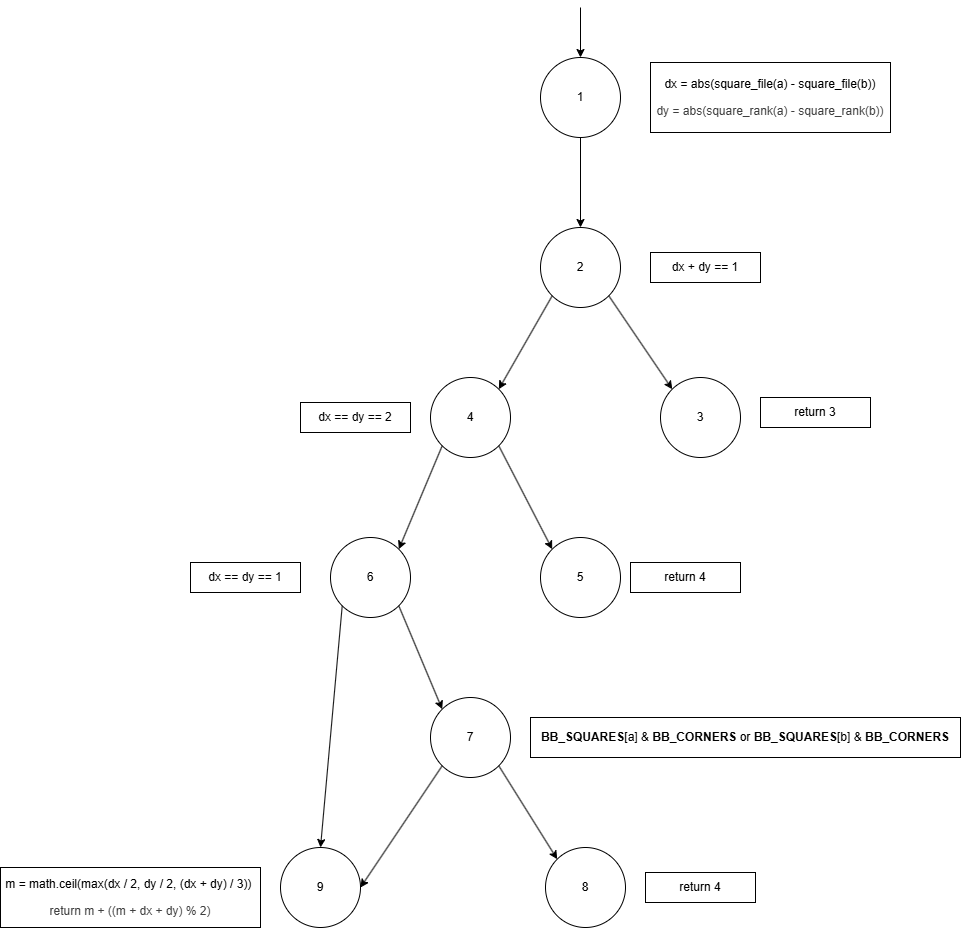
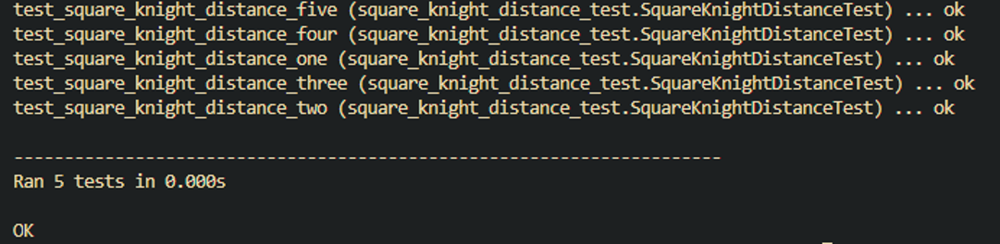
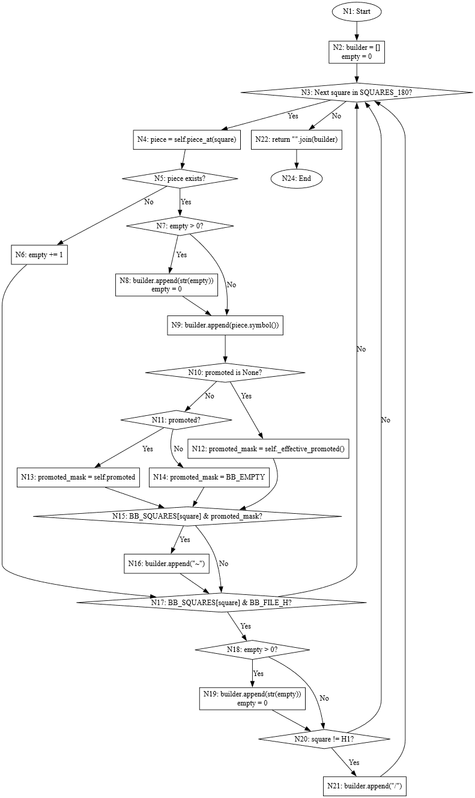
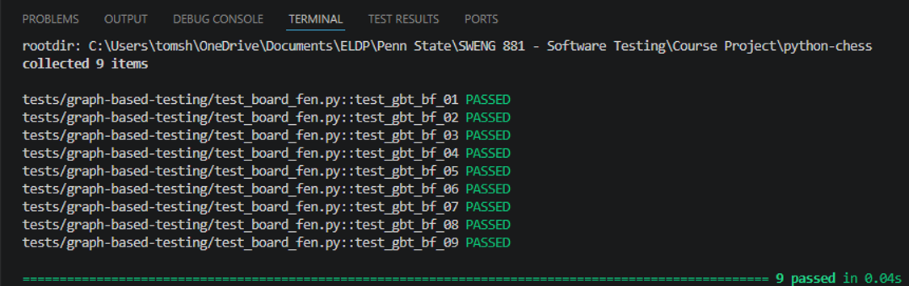

### 5.2.2 Graph-Based Testing

#### **5.2.2.1 Square Knight Distance Graph**

**Function:** square_knight_distance(a: Square, b: Square) -> int 
**Codebase Source:** python-chess/chess/__init__.py 
**Test Location:** python-chess/tests/graph-based-testing/square_knight_distance_test.py 

The graph model for square knight distance is shown below: 

|   Node   | Description  |
| -------  | -------------|
|   1   | dx = abs(square_file(a) - square_file(b)), dy = abs(square_rank(a) - square_rank(b))  |
|   2   | if(dx + dy == 1)  |
|   3   | return 3  |
|   4   | elif(dx == dy == 2)   |
|   5	|   return 4    |
|   6	|   elif(dx == dy == 1) |
|   7   |   if(BB_SQUARES[a] & BB_CORNERS or BB_SQUARES[b] & BB_CORNERS)    |
|   8	|   return 4    |
|   9	|   m = math.ceil(max(dx / 2, dy / 2, (dx + dy) / 3)), return m + ((m + dx + dy) % 2)   |

**Testing Coverage Criteria** 
Branch/Edge Coverage was chosen for the testing coverage criteria since it covers all the edges in the graph and ensures that key decision points are tested at least once. Since I’m able to test every edge for this function, using branch coverage would be the best choice while also reducing the number of test cases. 

**Test Cases**
|  Test ID	|   Test Description	|   Test Path   |
|  -------	|   -----------------	|   ---------   |
| GBT-SD-01	|   Square a is next to square b horizontally, with a being bigger than b. |	1 → 2 → 3   |
| GBT-SD-02	|   Square a is two squares diagonally away from square b, with square a being bigger than b. |	1 → 2 → 4 → 5   |
| GBT-SD-03	|   Square a is one square diagonally away from square b and square a or square b is a corner square. | 1 → 2 → 4 → 6 → 7 → 8  |
| GBT-SD-04	|   Square a is one square diagonally away from square b.   |   1 → 2 → 4 → 6 → 7 → 9  |
| GBT-SD-05	|   Square b is a smaller rank or file than that of square a.   |  	1 → 2 → 4 → 6 → 9 |

**Test Results**
| Test ID   | Expected Output   | Test Result |
| --------- | ----------------- | ----------- |
| GBT-SD-01 | Output: Returns 3 | Pass        |
| GBT-SD-02 | Output: Returns 4 | Pass        |
| GBT-SD-03 | Output: Returns 4 | Pass        |
| GBT-SD-04 | Output: Returns 2 | Pass        |
| GBT-SD-05 | Output: Returns 5 | Pass        |

#### **5.2.2.2 Board FEN Graph**
**Function:** board_fen(self, *, promoted: Optional[bool] = None) -> str 
**Codebase Source:** python-chess/chess/__init__.py 
**Test Location:** python-chess/tests/graph-based-testing/board_fen_test.py 

`board_fen(self, *, promoted: Optional[bool] = None) -> str` is the basis for most of python-chess’s board state representation functions. It takes the current board state and handles generation of the equivalent FEN string representation for that board state. Conditional checks are used to ensure that each element of the output string aligns with the FEN standard.  

| **Node** | **Description**                                                                               |
| -------- | --------------------------------------------------------------------------------------------- |
| N1       | Entry point of the board_fen() function.                                                      |
| N2       | Initializes the output builder list and the empty square counter.                             |
| N3       | Loop condition: checks whether there is another square to process in SQUARES_180.             |
| N4       | Retrieves the piece located on the current square.                                            |
| N5       | Determines whether the current square contains a piece.                                       |
| N6       | Increments the count of consecutive empty squares.                                            |
| N7       | Checks whether there are accumulated empty squares that need to be flushed to the FEN string. |
| N8       | Appends the accumulated empty-square count to the builder and resets the counter.             |
| N9       | Appends the current piece's symbol to the builder.                                            |
| N10      | Checks whether the promoted parameter is None.                                                |
| N11      | Checks whether the promoted parameter evaluates to True.                                      |
| N12      | Uses self._effective_promoted() to determine the promotion mask.                              |
| N13      | Uses self.promoted as the promotion mask.                                                     |
| N14      | Uses BB_EMPTY as the promotion mask (effectively disabling promotion markers).                |
| N15      | Checks whether the current square is marked as promoted in the selected promotion mask.       |
| N16      | Appends the "~" promotion marker to the builder.                                              |
| N17      | Checks whether the current square is on file H (the end of a board rank).                     |
| N18      | Checks whether any pending empty squares must be written before closing the rank.             |
| N19      | Appends the pending empty-square count and resets the counter.                                |
| N20      | Checks whether the current square is not H1.                                                  |
| N21      | Appends the rank separator "/" to the builder.                                                |
| N22      | Constructs and returns the final FEN string by joining all builder elements.                  |
| N24      | Exit point of the function after the return statement completes.                              |

**Testing Coverage Criteria**
To ensure that every decision point in board_fen() is exercised, Branch/Edge Coverage was used to determine the test paths and subsequent test cases. Branch coverage was used because the function contains multiple conditional paths that influence FEN generation. Verifying every branch provides confidence that all logical behaviors of the function are executed and validated while keeping the test suite concise and maintainable.  

**Test Cases**
| **Test ID** | **Test Description**                                                                                                                                            | **Test Path**                                                                                      |
| ----------- | --------------------------------------------------------------------------------------------------------------------------------------------------------------- | -------------------------------------------------------------------------------------------------- |
| GBT-BF-01   | Empty square encountered, not at end of rank. Covers N5(No) and N17(No).                                                                                        | N1 → N2 → N3 → N4 → N5 → N6 → N17 → N3                                                             |
| GBT-BF-02   | Piece encountered with no pending empty squares, promoted is None, square not promoted, not at end of rank. Covers N5(Yes), N7(No), N10(Yes), N15(No), N17(No). | N1 → N2 → N3 → N4 → N5 → N7 → N9 → N10 → N12 → N15 → N17 → N3                                      |
| GBT-BF-03   | Piece encountered after empty squares, promoted is None, promoted square, not at end of rank. Covers N7(Yes), N15(Yes).                                         | N1 → N2 → N3 → N4 → N5 → N6 → N17 → N3 → N4 → N5 → N7 → N8 → N9 → N10 → N12 → N15 → N16 → N17 → N3 |
| GBT-BF-04   | Piece encountered, promoted=True, square not promoted. Covers N10(No), N11(Yes).                                                                                | N1 → N2 → N3 → N4 → N5 → N7 → N9 → N10 → N11 → N13 → N15 → N17 → N3                                |
| GBT-BF-05   | Piece encountered, promoted=False, square not promoted. Covers N11(No).                                                                                         | N1 → N2 → N3 → N4 → N5 → N7 → N9 → N10 → N11 → N14 → N15 → N17 → N3                                |
| GBT-BF-06   | End-of-rank reached with pending empty squares and square not equal to H1. Covers N17(Yes), N18(Yes), N20(Yes).                                                 | N1 → N2 → N3 → N4 → N5 → N6 → N17 → N18 → N19 → N20 → N21 → N3                                     |
| GBT-BF-07   | End-of-rank reached with no pending empty squares and square not equal to H1. Covers N18(No), N20(Yes).                                                         | N1 → N2 → N3 → N4 → N5 → N7 → N9 → N10 → N12 → N15 → N17 → N18 → N20 → N21 → N3                    |
| GBT-BF-08   | End-of-rank reached at H1 with no pending empty squares. Covers N20(No).                                                                                        | N1 → N2 → N3 → N4 → N5 → N7 → N9 → N10 → N12 → N15 → N17 → N18 → N20 → N3                          |
| GBT-BF-09   | Loop termination and function return. Covers N3(No) and return path.                                                                                            | N1 → N2 → N3 → N22 → N24                                                                           |

**Test Results**
| **Test ID** | **Expected Output**                                 | **Test Result** |
| ----------- | --------------------------------------------------- | --------------- |
| GBT-BF-01   | Output: 8/8/8/8/8/8/8/8                             | PASSED          |
| GBT-BF-02   | Output: R7/8/8/8/8/8/8/8                            | PASSED          |
| GBT-BF-03   | Output: 1Q~6/8/8/8/8/8/8/8                          | PASSED          |
| GBT-BF-04   | Output: R7/8/8/8/8/8/8/8                            | PASSED          |
| GBT-BF-05   | Output: Q7/8/8/8/8/8/8/8                            | PASSED          |
| GBT-BF-06   | Output: 8/8/8/8/8/8/8/8                             | PASSED          |
| GBT-BF-07   | Output: 7R/8/8/8/8/8/8/8                            | PASSED          |
| GBT-BF-08   | Output: 8/8/8/8/8/8/8/7R                            | PASSED          |
| GBT-BF-09   | Output: rnbqkbnr/pppppppp/8/8/8/8/PPPPPPPP/RNBQKBNR | PASSED          |

