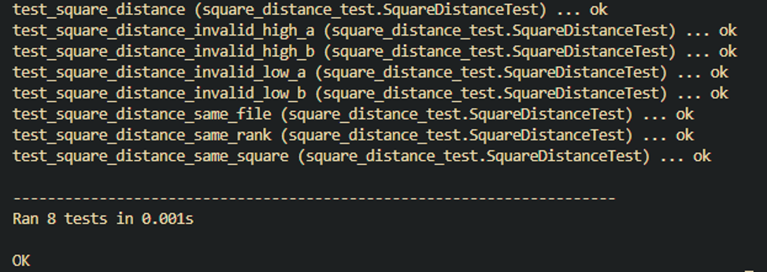
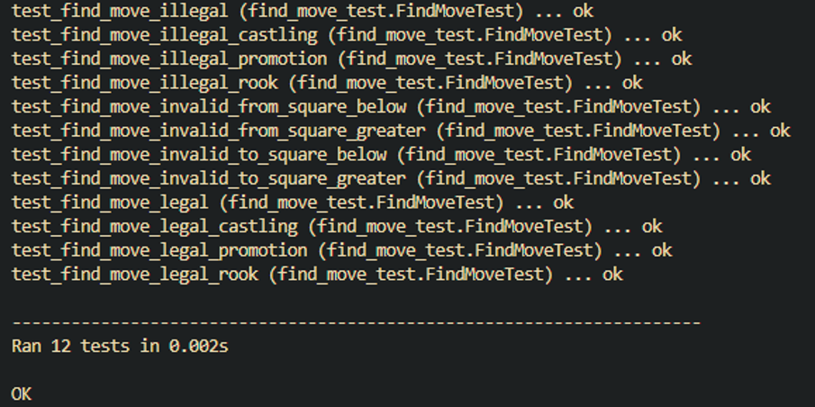
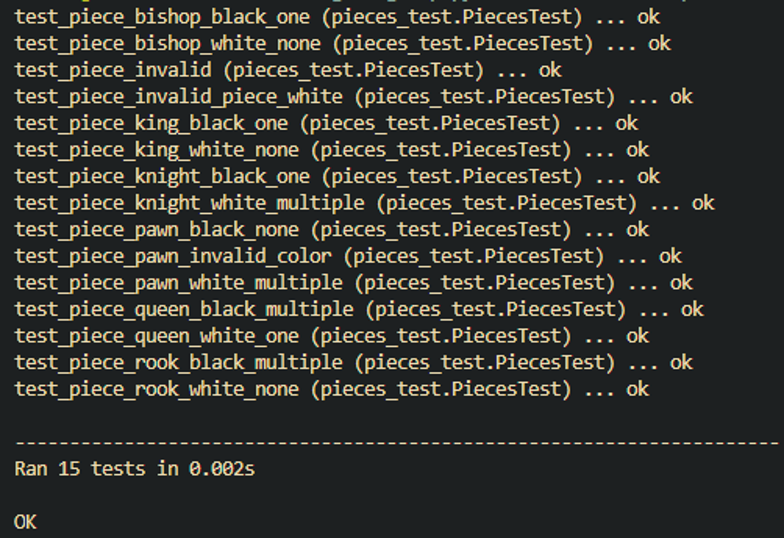
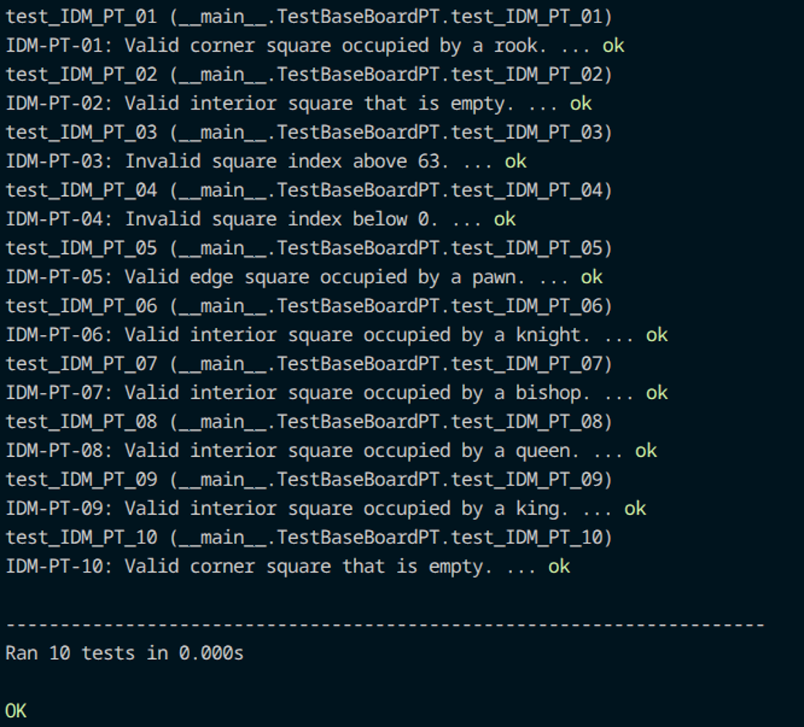
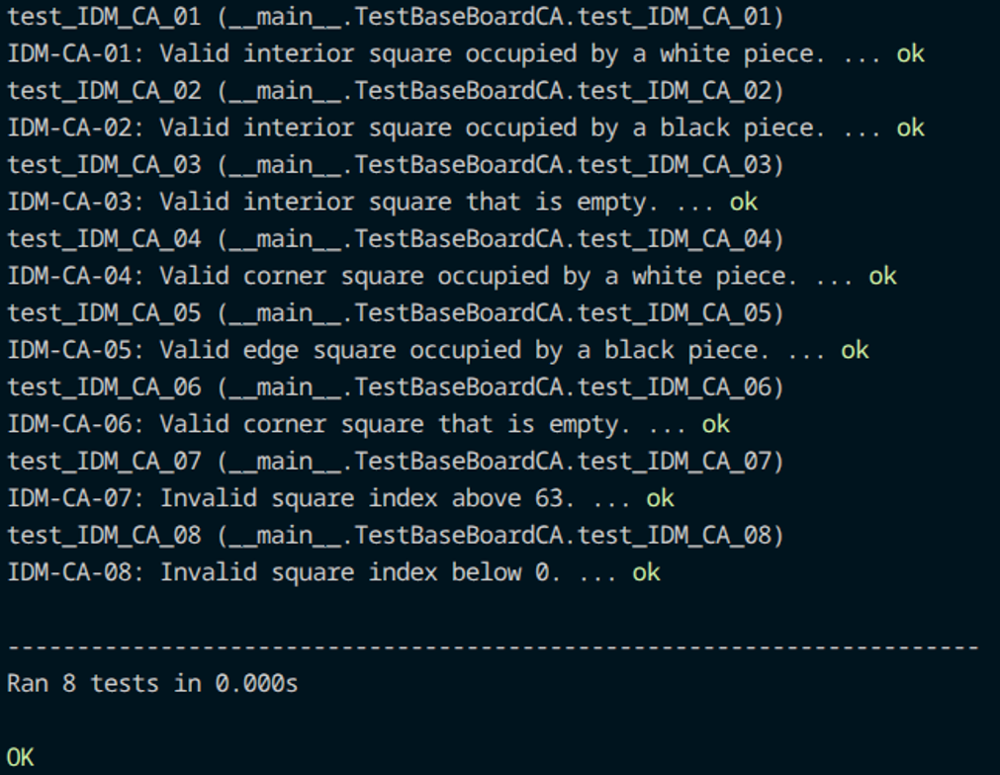
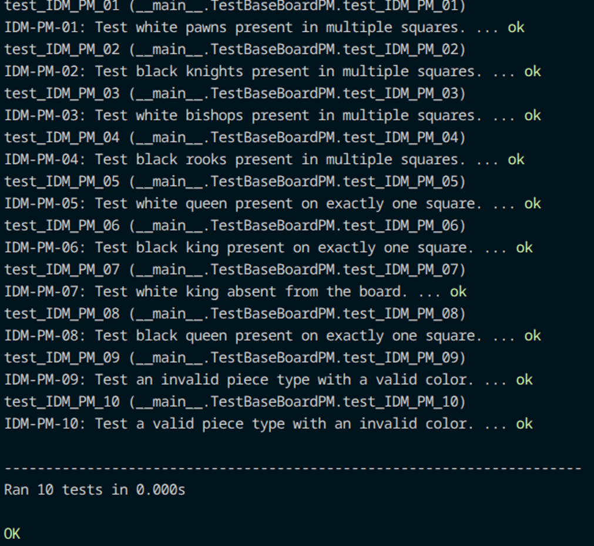
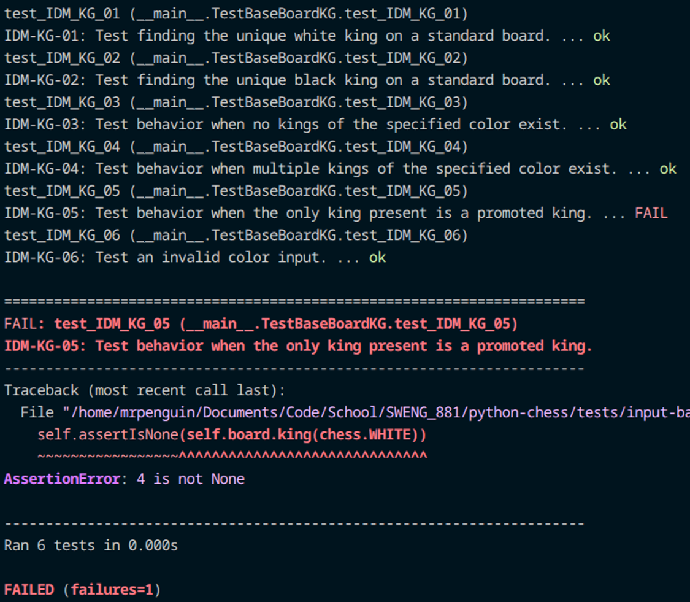
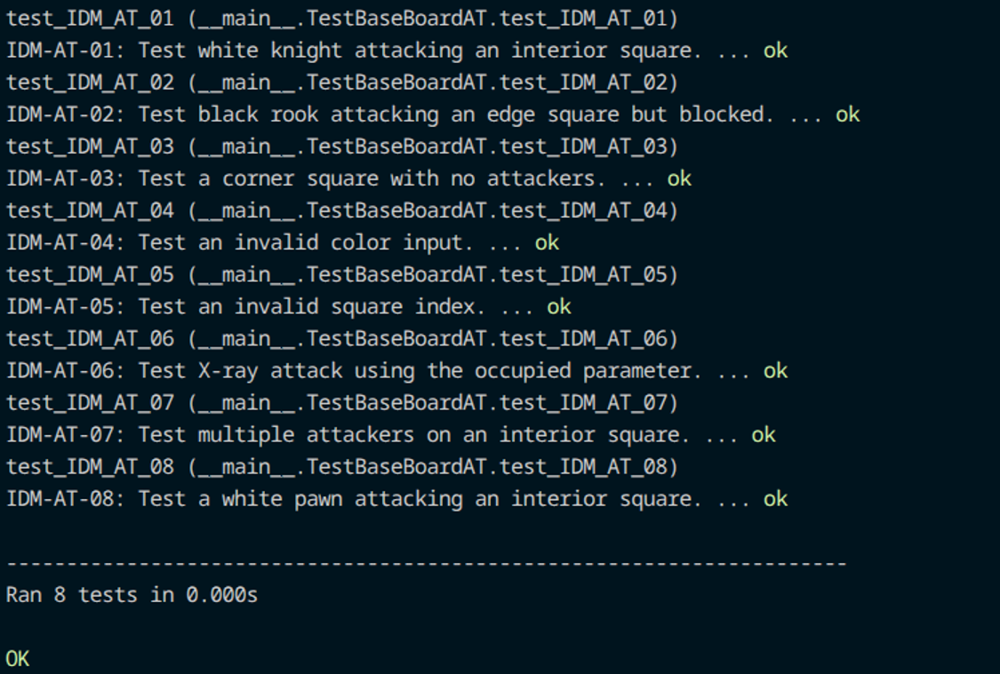
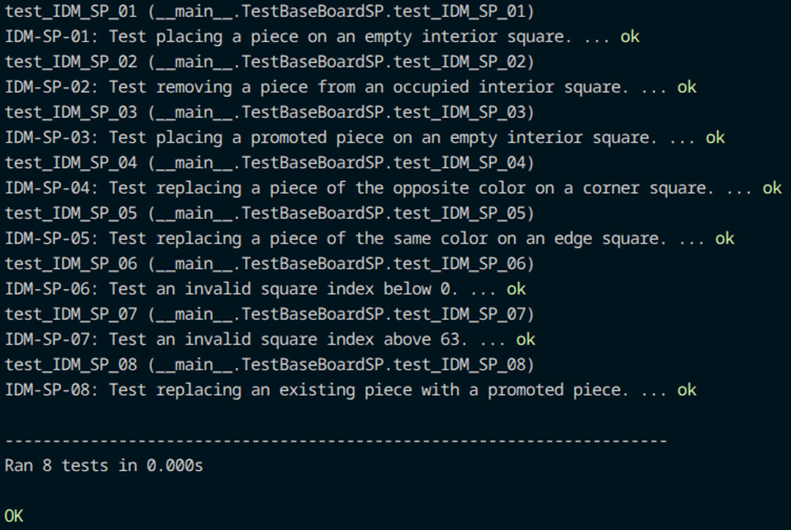
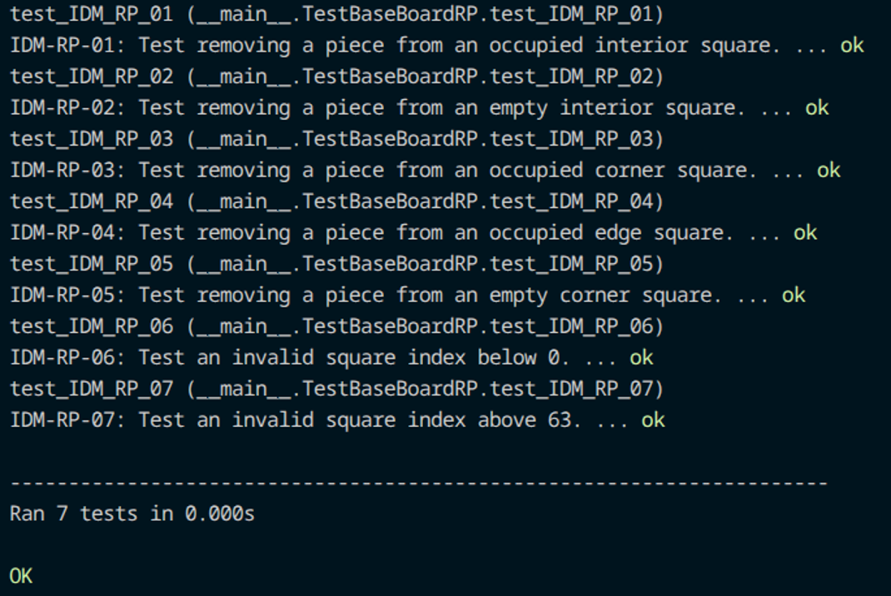

### 5.2.1 Input Domain Modeling Test Cases

#### **5.2.1.1	Get Chebyshev Distance IDM Test Cases**

**Function:** `def square_distance(a: Square, b: Square) -> int` 
**Codebase Source:** python-chess/chess/__init__.py 
**Test Location:** python-chess/tests/input-based-partitioning/square_distance_test.py 

This function calculates the Chebyshev distance (i.e. the number of king steps) between two chessboard spaces. It determines the distance by comparing the file and rank differences for the two squares and returns the larger number.

**List of Input Variables**

| Input Variable   |  Type  |       Definition       |
| ---------------- | ------ | ---------------------- |
|  a  | Square |The starting square on the chessboard. |
|  b  | Square | The ending square on the chessboard.|

**Characteristics of Input Variables**

| Variable   |  Characteristics    |
| ---------  | ------- |
|  a  | Is Square a the same as Square b? Is the input an integer? Is the square valid? Is the square rank the same as Square b? Is the square file the same as Square b? |
|  b  | Is Square b the same as Square a? Is the input an integer? Is the square valid? Is the square rank the same as Square a? Is the square file the same as Square a? |

**Partition the Characteristics into Blocks and Define Values**
| Characteristic                      | b1            | b2           | b3              | b4                      |
| ----------------------------------- | ------------- | ------------ | --------------- | ----------------------- |
| q1 = “range of square a”            | < 0 (invalid) | 0-63 (valid) | \> 63 (invalid) | \-                      |
| q2 = “range of square b”            | < 0 (invalid) | 0-63 (valid) | \> 63 (invalid) | \-                      |
| q3 = “relative position of a and b” | same square   | same rank    | same file       | different rank and file |

**Coverage Criteria**

Base Choice Coverage (BCC) was chosen since I’m able to change one characteristic at a time while also keeping the other characteristics at their base value, for instance the base value for q1 and q2 would be 0-63(valid).

**Test Set Definition**
| Test ID   | Description                                                         | q1    | q2    | q3                      |
| --------- | ------------------------------------------------------------------- | ----- | ----- | ----------------------- |
| IDM-SD-01 | Test both a valid Square a and Square b with default.               | 0-63  | 0-63  | different rank and file |
| IDM-SD-02 | Test an invalid Square a that is below 0.                           | < 0   | 0-63  | different rank and file |
| IDM-SD-03 | Test an invalid Square a that is above chess.H8 or 63.              | \> 63 | 0-63  | different rank and file |
| IDM-SD-04 | Test an invalid Square b that is below 0.                           | 0-63  | < 0   | different rank and file |
| IDM-SD-05 | Test an invalid Square b that is above chess.H8 or 63.              | 0-63  | \> 63 | different rank and file |
| IDM-SD-06 | Test a valid Square a and Square b where they have the same square. | 0-63  | 0-63  | same square             |
| IDM-SD-07 | Test a valid Square a and Square b where they have the same rank.   | 0-63  | 0-63  | same rank               |
| IDM-SD-08 | Test a valid Square a and Square b where they have the same file.   | 0-63  | 0-63  | same file               |

**Test Results**
| Test ID   | Description                                                         | Input blocks     | Expected Output | Test Result     |
| --------- | ------------------------------------------------------------------- | ---------------- | --------------- | --------------- |
| IDM-SD-01 | Test both a valid Square a and Square b with default.               | q1b2, q2b2, q3b4 | 7               | Pass            |
| IDM-SD-02 | Test an invalid Square a that is below 0.                           | q1b1, q2b2, q3b4 | Invalid square  | Needs follow up |
| IDM-SD-03 | Test an invalid Square a that is above chess.H8 or 63.              | q1b3, q2b2, q3b4 | Attribute Error | Needs follow up |
| IDM-SD-04 | Test an invalid Square b that is below 0.                           | q1b2, q2b1, q3b4 | Invalid Square  | Needs follow up |
| IDM-SD-05 | Test an invalid Square b that is above chess.H8 or 63.              | q1b2, q2b3, q3b4 | Attribute Error | Needs follow up |
| IDM-SD-06 | Test a valid Square a and Square b where they have the same square. | q1b2, q2b2, q3b1 | 0               | Pass            |
| IDM-SD-07 | Test a valid Square a and Square b where they have the same rank.   | q1b2, q2b2, q3b2 | 7               | Pass            |
| IDM-SD-08 | Test a valid Square a and Square b where they have the same file.   | q1b2, q2b2, q3b3 | 7               | Pass            |

#### **5.2.1.2 Find Legal Move  IDM Test Cases**

**Function:** `def find_move(self, from_square: Square, to_square: Square, promotion: Optional[PieceType] = None) -> Move` 
**Codebase Source:** python-chess/chess/__init__.py 
**Test Location:** python-chess/tests/input-based-partitioning/find_move_test.py 

This function is responsible for locating legal chess moves based on the starting square, the ending square, and optional promotion piece. It’s able to handle special cases like automatic pawn promotion, castling normalization, Chess960 move conversion, and move validation before returning a Move object.

**List of Input Variables**

| Input Variable   |  Type  |       Definition       |
| ---------------- | ------ | ---------------------- |
|  from_square  | Square | The starting square where the current piece is on the chess board. |
|  to_square  | Square | The ending square where the current piece wants to move on the chess board. |
|  promotion | Optional[PieceType] = None | If no promotion piece type is inputted, then piece type defaults to pawn.  |

**Characteristics of Input Variables**

| Variable   |  Characteristics    |
| ---------  | ------- |
|  from_square  | Is the starting square valid? Is the input an integer?  |
|  to_square  | Is the ending square valid? Is the input an integer? Is the move a legal move? Is there another piece in that square? |
|  promotion  | Is the promotion specified? |

**Partition the Characteristics into Blocks and Define Values**
| Characteristic   |  b1   | b2 | b3 | b4 |
| ---------  | ------- |---------  | ------- |---------  |
|  q1 = “range of from_square” | < 0 (invalid) | 0-63 (valid) | > 63 (invalid) | - |
|  q2 = “range of to_square”  | < 0 (invalid) | 0-63 (valid) | > 63 (invalid) | - |
|  q3 = “move context | normal move | castling move | promotion with default promotion | promotion with specified promotion |
|  q4 = “move legality” | legal move | illegal move | - | - |
|  q5 = “board context” | standard chess | chess960 | - | - |

**Coverage Criteria**

Pair-Wise Coverage (PWC) was selected since it is able to cover all pairs of blocks for the characteristics. Even with this coverage, there are some infeasible tests cases, for instance, castling requires valid squares, which means that IDM-FM-10 is infeasible.

**Test Set Definition**
| Test ID | Description |  q1   | q2 | q3 | q4 | q5 |
| --------| ------- |---------  | ------- | --------- | ---------  | ---------  |
|  IDM-FM-01 | Test a valid legal move in standard chess. | 0-63 (valid) | 0-63 (valid) | normal move | promotion with specified promotion | standard chess |
|  IDM-FM-02  | Test normal, illegal move in chess960. | 0-63 (valid) | 0-63 (valid) | normal move | illegal move | chess960 |
|  IDM-FM-03 | Test a valid legal castling move in standard chess. | 0-63 (valid) | 0-63 (valid) | castling move | promotion with specified promotion | standard chess |
|  IDM-FM-04 | Test an illegal castling move in chess960. | 0-63 (valid) | 0-63 (valid) | castling move | illegal move | chess960 |
|  IDM-FM-05 | Test a valid legal move where pawn moves to back rank and is promoted in standard chess. | 0-63 (valid) | 0-63 (valid) | promotion with default promotion | legal move | chess960 |
|  IDM-FM-06 | Test a valid illegal move where pawn moves to back rank in chess960. | 0-63 (valid) | 0-63 (valid) | promotion with default promotion | illegal move | chess960 |
|  IDM-FM-07 | Test a valid legal move where promotion is specified to Rook in chess960. | 0-63 (valid) | 0-63 (valid) | promotion with specified promotion | legal move | chess960 |
|  IDM-FM-08 | Test an illegal move where promotion is specified to Rook in standard chess. | 0-63 (valid) | 0-63 (valid) | promotion with specified promotion | illegal move | standard chess |
|  IDM-FM-09 | Test an invalid previous square input that is below 0 in standard chess. | < 0 (invalid) | 0-63 (valid) | normal move | illegal move | standard chess |
|  IDM-FM-10 | Test an invalid previous square input that is greater than 63 in chess960. | > 63 (invalid) | 0-63 (valid) | castling move | illegal move | chess960 |
|  IDM-FM-11 | Test an invalid to_square input that is below 0 in standard chess. | 0-63 (valid) | < 0 (invalid) | promotion with default promotion | illegal move | standard chess |
|  IDM-FM-12 | Test an invalid to_square input that is greater than 63 in chess960. | 0-63 (valid) | > 63 (invalid) | promotion with specified promotion | illegal move | chess960 |

**Test Results**
| Test ID | Description |  Input Blocks   | Expected Output | Test Result | 
| --------| ------- |---------  | ------- | --------- | 
|  IDM-FM-01 | Test a valid legal move in standard chess. | q1b2, q2b2, q3b1, q4b1, q5b1 | "e2e3” | Pass |
|  IDM-FM-02  | Test normal, illegal move in chess960. | q1b2, q2b2, q3b1, q4b2, q5b2 | IllegalMoveError | Pass | 
|  IDM-FM-03 | Test a valid legal castling move in standard chess. | q1b2, q2b2, q3b2, q4b1, q5b1 | “e1g1” | Pass | 
|  IDM-FM-04 | Test an illegal castling move in chess960. | q1b2, q2b2, q3b2, q4b2, q5b2 | IllegalMoveError | Pass | 
|  IDM-FM-05 | Test a valid legal move where pawn moves to back rank and is promoted in standard chess. | q1b2, q2b2, q3b3, q4b1, q5b1 | “e7e8q” | Pass | 
|  IDM-FM-06 | Test a valid illegal move where pawn moves to back rank in chess960. | q1b2, q2b2, q3b3, q4b2, q5b2 | IllegalMoveError | Needs follow up | 
|  IDM-FM-07 | Test a valid legal move where promotion is specified to Rook in chess960. | q1b2, q2b2, q3b4, q4b1, q5b2 | “e7e8r” | Pass | 
|  IDM-FM-08 | Test an illegal move where promotion is specified to Rook in standard chess. | q1b2, q2b2, q3b4, q4b2, q5b1 | IllegalMoveError | Pass | 
|  IDM-FM-09 | Test an invalid previous square input that is below 0 in standard chess. | q1b1, q2b2, q3b1, q4b2, q5b1 | IllegalMoveError | Pass | 
|  IDM-FM-10 | Test an invalid previous square input that is greater than 63 in chess960. | q1b3, q2b2, q3b2, q4b2, q5b2 | IndexError | Pass |  
|  IDM-FM-11 | Test an invalid to_square input that is below 0 in standard chess. | q1b2, q2b1, q3b3, q4b2, q5b1 | IllegalMoveError | Pass |  
|  IDM-FM-12 | Test an invalid to_square input that is greater than 63 in chess960. | q1b2, q2b3, q3b4, q4b2, q5b2 | IndexError | Pass | 

#### **5.2.1.3	Get Pieces on Board IDM Test Cases**

**Function:** `def pieces(self, piece_type: PieceType, color: Color) -> SquareSet` 
**Codebase Source:** python-chess/chess/__init__.py 
**Test Location:** python-chess/tests/input-based-partitioning/pieces_test.py 

This function is responsible for retrieving the squares that are occupied by the specified piece type and color on the current chessboard. It’s able to generate and return a SquareSet containing the locations of the matching pieces based on the provided inputs. 

**List of Input Variables**

| Input Variable   |  Type  |       Definition       |
| ---------------- | ------ | ---------------------- |
|  piece_type  | PieceType | An integer to get the specified piece types: pawn, knight, bishop, rook, queen, and king. |
|  color  | Color | A bool to see if the color is either White or Black. |

**Characteristics of Input Variables**

| Variable   |  Characteristics    |
| ---------  | ------- |
|  piece_type  | Is the piece type a valid type? Is there multiple pieces on the board? |
|  color  | Is the piece color a valid color? |

**Partition the Characteristics into Blocks and Define Values**
| Characteristic   |  b1   | b2 | b3 | b4 | b5 | b6 | b7 |
| ---------  | ------- |---------  | ------- |---------  |---------  |---------  |---------  |
|  q1 = ”piece type” | pawn | knight | bishop | rook | queen | king | invalid piecetype |
|  q2 = ”color”  | white |	black |	invalid color |	- | - | - | - |
|  q3 = ”matching pieces on board” | 0 | 1 | > 1 | - | - | - | - |

**Coverage Criteria**

Pair-Wise Coverage (PWC) was selected since it’s able to cover every piece type, color, and matching pieces without the need for having redundant test cases. 

**Test Set Definition**
| Test ID | Description |  q1   | q2 | q3 |
| --------| ------- |---------  | ------- | --------- |
|  IDM-PC-01 | Test that white pawns are present in multiple squares. | pawn | white | > 1 |
|  IDM-PC-02  | Test that black knight is present on exactly one square. | knight | black | 1 |
|  IDM-PC-03 | Test that white bishops are absent from the board. | bishop | white | 0 |
|  IDM-PC-04 | Test that black rooks are present in multiple squares. | rook | black | > 1 | 
|  IDM-PC-05 | Test that white queen is present on exactly one square. | queen| white | 1 | 
|  IDM-PC-06 | Test that black king is present on exactly one square. | king | black | 1 |
|  IDM-PC-07 | Test that black pawns are absent from the board. | pawn | black | 0 |
|  IDM-PC-08 | Test that white knights are present in multiple squares. | knight | white | > 1 |
|  IDM-PC-09 | Test that black bishop is present on exactly one square. | bishop | black | 1 |
|  IDM-PC-10 | Test that white rooks are absent from the board. | rook | white | 0 | 
|  IDM-PC-11 | Test that black queen is present on multiple squares. | queen | black | > 1 | 
|  IDM-PC-12 | Test that white king is absent on the board. | king | white | 0 | 
|  IDM-PC-13 | Test an invalid input for piece type with valid color. | invalid piece type | white | - | 
|  IDM-PC-14 | Test a valid piece type with an invalid color. | pawn | invalid color | - | 
|  IDM-PC-15 | Test both an invalid piece type and invalid color. | invalid piece type | invalid color | - | 

**Test Results**
| Test ID | Description |  Input Blocks   | Expected Output | Test Result | 
| --------| ------- |---------  | ------- | --------- | 
|  IDM-PC-01 | Test that white pawns are present in multiple squares. | q1b1, q2b1, q3b3 | chess.SquareSet(chess.BB_RANK2) | Pass |
|  IDM-PC-02  | Test that black knight is present on exactly one square. | q1b2, q2b2, q3b2 | chess.SquareSet(chess.BB_F6)  | Pass |
|  IDM-PC-03 | Test that white bishops are absent from the board. | q1b3, q2b1, q3b1 | chess.SquareSet(chess.BB_EMPTY)	Pass |
|  IDM-PC-04 | Test that black rooks are present in multiple squares. | q1b4, q2b2, q3b3 | chess.SquareSet([chess.A8, chess.H8]) | Pass | 
|  IDM-PC-05 | Test that white queen is present on exactly one square. | q1b5, q2b1, q3b2 | chess.SquareSet(chess.BB_D1) | Pass | 
|  IDM-PC-06 | Test that black king is present on exactly one square. | q1b6, q2b2, q3b2 | chess.SquareSet(chess.BB_E8) | Pass |
|  IDM-PC-07 | Test that black pawns are absent from the board. | q1b1, q2b2, q3b1 | chess.SquareSet(chess.BB_EMPTY) | Pass |
|  IDM-PC-08 | Test that white knights are present in multiple squares. | q1b2, q2b1, q3b3 | chess.SquareSet([chess.B1, chess.G1]) | Pass |
|  IDM-PC-09 | Test that black bishop is present on exactly one square. | q1b3, q2b2, q3b2 | chess.SquareSet(chess.BB_C8) | Pass |
|  IDM-PC-10 | Test that white rooks are absent from the board. | q1b4, q2b1, q3b1 | chess.SquareSet(chess.EMPTY) | Pass | 
|  IDM-PC-11 | Test that black queen is present on multiple squares. | q1b5, q2b2, q3b3 | chess.SquareSet([chess.B8, chess.D8]) | Pass | 
|  IDM-PC-12 | Test that white king is absent on the board. | q1b6, q2b1, q3b1 | chess.SquareSet(chess.BB_EMPTY) | Pass| 
|  IDM-PC-13 | Test an invalid input for piece type with valid color. | q1b7, q2b1 | AssertionError | Pass | 
|  IDM-PC-14 | Test a valid piece type with an invalid color. | q1b1, q2b3 | NameError | Pass| 
|  IDM-PC-15 | Test both an invalid piece type and invalid color. | q1b7, q2b3 | AssertionError | Pass | 

#### **5.2.1.4 Get Piece Type At IDM Test Cases**

**Function:** `def piece_type_at(self, square: Square) -> Optional[PieceType]` 
**Codebase Source:** python-chess/chess/__init__.py 
**Test Location:** python-chess/tests/input-based-partitioning/piece_type_at_idm_test.py 

This function determines the type of piece occupying a specific square on the chessboard. It checks the square index against various piece bitboards (pawns, knights, bishops, rooks, queens, and kings) and returns the corresponding piece type constant or None if the square is empty.  

**List of Input Variables** 
| **Input Variable** | **Type** | **Definition**                           |
| ------------------ | -------- | ---------------------------------------- |
| square             | Square   | The index of the square to check (0-63). |

**Characteristics of Input Variables**

| **Variable** | **Characteristics**                                                                                                                       |
| ------------ | ----------------------------------------------------------------------------------------------------------------------------------------- |
| square       | Is the square index valid? Is the square empty? If occupied, what is the piece type? What is the board location (Corner, Edge, Interior)? |

**Partition the Characteristics into Blocks and Define Values**

| **Characteristic**     | **b1**        | **b2**       | **b3**          | **b4** | **b5** | **b6** | **b7** |
| ---------------------- | ------------- | ------------ | --------------- | ------ | ------ | ------ | ------ |
| q1 = “range of square” | < 0 (invalid) | 0-63 (valid) | \> 63 (invalid) | \-     | \-     | \-     | \-     |
| q2 = “occupancy”       | empty         | occupied     | \-              | \-     | \-     | \-     | \-     |
| q3 = “piece type”      | pawn          | knight       | bishop          | rook   | queen  | king   | \-     |
| q4 = “location”        | corner        | edge         | interior        | \-     | \-     | \-     | \-     |

**Coverage Criteria** 
Base Choice Coverage (BCC) was chosen to ensure that every single piece type is verified at least once and that all boundary conditions for the square index are exercised. The base values chosen are: q1=0-63 (valid), q2=occupied, q3=pawn, q4=interior. 

**Test Set Definition**
| **Test ID** | **Description**                                    | **q1** | **q2**   | **q3** | **q4**   |
| ----------- | -------------------------------------------------- | ------ | -------- | ------ | -------- |
| IDM-PT-01   | Test a valid corner square occupied by a rook.     | 0-63   | occupied | rook   | corner   |
| IDM-PT-02   | Test a valid interior square that is empty.        | 0-63   | empty    | \-     | interior |
| IDM-PT-03   | Test an invalid square index above 63.             | \> 63  | \-       | \-     | \-       |
| IDM-PT-04   | Test an invalid square index below 0.              | < 0    | \-       | \-     | \-       |
| IDM-PT-05   | Test a valid edge square occupied by a pawn.       | 0-63   | occupied | pawn   | edge     |
| IDM-PT-06   | Test a valid interior square occupied by a knight. | 0-63   | occupied | knight | interior |
| IDM-PT-07   | Test a valid interior square occupied by a bishop. | 0-63   | occupied | bishop | interior |
| IDM-PT-08   | Test a valid interior square occupied by a queen.  | 0-63   | occupied | queen  | interior |
| IDM-PT-09   | Test a valid interior square occupied by a king.   | 0-63   | occupied | king   | interior |
| IDM-PT-10   | Test a valid corner square that is empty.          | 0-63   | empty    | \-     | corner   |

**Test Results**
| **Test ID** | **Description**                                    | **Input Blocks**       | **Expected Output** | **Test Result** |
| ----------- | -------------------------------------------------- | ---------------------- | ------------------- | --------------- |
| IDM-PT-01   | Test a valid corner square occupied by a rook.     | q1b2, q2b2, q3b4, q4b1 | chess.ROOK          | Pass            |
| IDM-PT-02   | Test a valid interior square that is empty.        | q1b2, q2b1, q4b3       | None                | Pass            |
| IDM-PT-03   | Test an invalid square index above 63.             | q1b3                   | IndexError          | Pass            |
| IDM-PT-04   | Test an invalid square index below 0.              | q1b1                   | IndexError          | Pass            |
| IDM-PT-05   | Test a valid edge square occupied by a pawn.       | q1b2, q2b2, q3b1, q4b2 | chess.PAWN          | Pass            |
| IDM-PT-06   | Test a valid interior square occupied by a knight. | q1b2, q2b2, q3b2, q4b3 | chess.KNIGHT        | Pass            |
| IDM-PT-07   | Test a valid interior square occupied by a bishop. | q1b2, q2b2, q3b3, q4b3 | chess.BISHOP        | Pass            |
| IDM-PT-08   | Test a valid interior square occupied by a queen.  | q1b2, q2b2, q3b5, q4b3 | chess.QUEEN         | Pass            |
| IDM-PT-09   | Test a valid interior square occupied by a king.   | q1b2, q2b2, q3b6, q4b3 | chess.KING          | Pass            |
| IDM-PT-10   | Test a valid corner square that is empty.          | q1b2, q2b1, q4b1       | None                | Pass            |

#### **5.2.1.5 Get Color At IDM Test Cases**

**Function:** `def color_at(self, square: Square) -> Optional[Color]` 
**Codebase Source:** python-chess/chess/__init__.py 
**Test Location:** python-chess/tests/input-based-partitioning/color_at_idm_test.py 

This function retrieves the color of the piece occupying a specific square on the chessboard. It checks the occupancy masks for both white and black pieces and returns the corresponding color constant (chess.WHITE or chess.BLACK) or None if the square is empty. 

**List of Input Variables**
| **Input Variable** | **Type** | **Definition**                           |
| ------------------ | -------- | ---------------------------------------- |
| square             | Square   | The index of the square to check (0-63). |

**Characteristics of Input Variables**
| **Variable** | **Characteristics**                                                                                                                               |
| ------------ | ------------------------------------------------------------------------------------------------------------------------------------------------- |
| square       | Is the square index valid? Is the square empty? If occupied, what is the color of the piece? What is the board location (Corner, Edge, Interior)? |

**Partition the Characteristics into Blocks and Define Values**
| **Characteristic**     | **b1**        | **b2**       | **b3**          | **b4** |
| ---------------------- | ------------- | ------------ | --------------- | ------ |
| q1 = “range of square” | < 0 (invalid) | 0-63 (valid) | \> 63 (invalid) | \-     |
| q2 = “occupancy/color” | empty         | white        | black           | \-     |
| q3 = “location”        | corner        | edge         | interior        | \-     |

**Coverage Criteria**

Base Choice Coverage (BCC) was chosen to ensure that all colors (White, Black, and None) are verified across different board locations and that boundary conditions for the square index are exercised. The base values chosen are: q1=0-63 (valid), q2=white, q3=interior.

**Test Set Definition**

| **Test ID** | **Description**                                         | **q1** | **q2** | **q3**   |
| ----------- | ------------------------------------------------------- | ------ | ------ | -------- |
| IDM-CA-01   | Test a valid interior square occupied by a white piece. | 0-63   | white  | interior |
| IDM-CA-02   | Test a valid interior square occupied by a black piece. | 0-63   | black  | interior |
| IDM-CA-03   | Test a valid interior square that is empty.             | 0-63   | empty  | interior |
| IDM-CA-04   | Test a valid corner square occupied by a white piece.   | 0-63   | white  | corner   |
| IDM-CA-05   | Test a valid edge square occupied by a black piece.     | 0-63   | black  | edge     |
| IDM-CA-06   | Test a valid corner square that is empty.               | 0-63   | empty  | corner   |
| IDM-CA-07   | Test an invalid square index above 63.                  | \> 63  | \-     | \-       |
| IDM-CA-08   | Test an invalid square index below 0.                   | < 0    | \-     | \-       |

**Test Results**

| **Test ID** | **Description**                                         | **Input Blocks** | **Expected Output** | **Test Result** |
| ----------- | ------------------------------------------------------- | ---------------- | ------------------- | --------------- |
| IDM-CA-01   | Test a valid interior square occupied by a white piece. | q1b2, q2b2, q3b3 | chess.WHITE         | Pass            |
| IDM-CA-02   | Test a valid interior square occupied by a black piece. | q1b2, q2b3, q3b3 | chess.BLACK         | Pass            |
| IDM-CA-03   | Test a valid interior square that is empty.             | q1b2, q2b1, q3b3 | None                | Pass            |
| IDM-CA-04   | Test a valid corner square occupied by a white piece.   | q1b2, q2b2, q3b1 | chess.WHITE         | Pass            |
| IDM-CA-05   | Test a valid edge square occupied by a black piece.     | q1b2, q2b3, q3b2 | chess.BLACK         | Pass            |
| IDM-CA-06   | Test a valid corner square that is empty.               | q1b2, q2b1, q3b1 | None                | Pass            |
| IDM-CA-07   | Test an invalid square index above 63.                  | q1b3             | IndexError          | Pass            |
| IDM-CA-08   | Test an invalid square index below 0.                   | q1b1             | IndexError          | Pass            |

#### **5.2.1.6 Get Pieces Mask IDM Test Cases**

**Function:** `def pieces_mask(self, piece_type: PieceType, color: Color) -> Bitboard` 
**Codebase Source:** python-chess/chess/__init__.py 
**Test Location:** python-chess/tests/input-based-partitioning/pieces_mask_idm_test.py 

This function returns a bitmask (Bitboard) representing all squares occupied by pieces of a specific type and color. It retrieves the global bitboard for the requested piece type and performs a bitwise AND operation with the occupancy mask of the specified color. 

**List of Input Variables**
| **Input Variable** | **Type**  | **Definition**                                                         |
| ------------------ | --------- | ---------------------------------------------------------------------- |
| piece_type         | PieceType | An integer representing the piece type (e.g., PAWN=1, KNIGHT=2, etc.). |
| color              | Color     | A boolean representing the color (White = True, Black = False).        |

**Characteristics of Input Variables**
| **Variable** | **Characteristics**                                                                           |
| ------------ | --------------------------------------------------------------------------------------------- |
| piece_type   | Is the piece type valid? Is it one of the six standard types?                                 |
| color        | Is the color valid (White or Black)?                                                          |
| board state  | Are there pieces of the specified type and color currently on the board? (0, 1, or multiple). |

**Partition the Characteristics into Blocks and Define Values**
| **Characteristic**     | **b1** | **b2** | **b3**        | **b4** | **b5** | **b6** | **b7**       |
| ---------------------- | ------ | ------ | ------------- | ------ | ------ | ------ | ------------ |
| q1 = “piece type”      | pawn   | knight | bishop        | rook   | queen  | king   | invalid type |
| q2 = “color”           | white  | black  | invalid color | \-     | \-     | \-     | \-           |
| q3 = “matching pieces” | 0      | 1      | \> 1          | \-     | \-     | \-     | \-           |

**Coverage Criteria** 
Pair-Wise Coverage (PWC) was selected to ensure that all piece types and both colors are tested in various combinations of board occupancy without requiring an exhaustive matrix of every single possibility. 

**Test Set Definition**
| **Test ID** | **Description**                                 | **q1**       | **q2**        | **q3** |
| ----------- | ----------------------------------------------- | ------------ | ------------- | ------ |
| IDM-PM-01   | Test white pawns present in multiple squares.   | pawn         | white         | \> 1   |
| IDM-PM-02   | Test black knights present in multiple squares. | knight       | black         | \> 1   |
| IDM-PM-03   | Test white bishops present in multiple squares. | bishop       | white         | \> 1   |
| IDM-PM-04   | Test black rooks present in multiple squares.   | rook         | black         | \> 1   |
| IDM-PM-05   | Test white queen present on exactly one square. | queen        | white         | 1      |
| IDM-PM-06   | Test black king present on exactly one square.  | king         | black         | 1      |
| IDM-PM-07   | Test white king absent from the board.          | king         | white         | 0      |
| IDM-PM-08   | Test black queen present on exactly one square. | queen        | black         | 1      |
| IDM-PM-09   | Test an invalid piece type with a valid color.  | invalid type | white         | \-     |
| IDM-PM-10   | Test a valid piece type with an invalid color.  | pawn         | invalid color | \-     |

**Test Results**
| **Test ID** | **Description**                                 | **Input Blocks** | **Expected Output**   | **Test Result** |
| ----------- | ----------------------------------------------- | ---------------- | --------------------- | --------------- |
| IDM-PM-01   | Test white pawns present in multiple squares.   | q1b1, q2b1, q3b3 | Bitboard (8 bits set) | Pass            |
| IDM-PM-02   | Test black knights present in multiple squares. | q1b2, q2b2, q3b3 | Bitboard (2 bits set) | Pass            |
| IDM-PM-03   | Test white bishops present in multiple squares. | q1b3, q2b1, q3b3 | Bitboard (2 bits set) | Pass            |
| IDM-PM-04   | Test black rooks present in multiple squares.   | q1b4, q2b2, q3b3 | Bitboard (2 bits set) | Pass            |
| IDM-PM-05   | Test white queen present on exactly one square. | q1b5, q2b1, q3b2 | Bitboard (1 bit set)  | Pass            |
| IDM-PM-06   | Test black king present on exactly one square.  | q1b6, q2b2, q3b2 | Bitboard (1 bit set)  | Pass            |
| IDM-PM-07   | Test white king absent from the board.          | q1b6, q2b1, q3b1 | BB_EMPTY (0)          | Pass            |
| IDM-PM-08   | Test black queen present on exactly one square. | q1b5, q2b2, q3b2 | Bitboard (1 bit set)  | Pass            |
| IDM-PM-09   | Test an invalid piece type with a valid color.  | q1b7, q2b1       | AssertionError        | Pass            |
| IDM-PM-10   | Test a valid piece type with an invalid color.  | q1b1, q2b3       | IndexError            | Pass            |

#### **5.2.1.7 Get King IDM Test Cases**

**Function:** `def king(self, color: Color) -> Optional[Square]` 
**Codebase Source:** python-chess/chess/__init__.py 
**Test Location:** python-chess/tests/input-based-partitioning/king_idm_test.py 

This function finds the unique square of the king for the given side. It identifies the king's position by intersecting the color occupancy mask with the king piece mask and excluding any promoted kings. It returns the square index if exactly one king is found; otherwise, it returns None. 

**List of Input Variables**
| **Input Variable** | **Type** | **Definition**                                                                |
| ------------------ | -------- | ----------------------------------------------------------------------------- |
| color              | Color    | A boolean representing the color to search for (White = True, Black = False). |

**Characteristics of Input Variables**
| **Variable** | **Characteristics**                                                               |
| ------------ | --------------------------------------------------------------------------------- |
| color        | Is the color valid?                                                               |
| board state  | How many kings of the specified color are present? Are any of the kings promoted? |

**Partition the Characteristics into Blocks and Define Values**
| **Characteristic** | **b1**            | **b2**                  | **b3**        | **b4** |
| ------------------ | ----------------- | ----------------------- | ------------- | ------ |
| q1 = “color”       | white             | black                   | invalid color | \-     |
| q2 = “king count”  | 0                 | 1                       | \> 1          | \-     |
| q3 = “promotion”   | no promoted kings | contains promoted kings | \-            | \-     |

**Coverage Criteria** 
Base Choice Coverage (BCC) was selected to ensure that the function correctly handles the "unique king" requirement across both colors and properly handles the edge cases of missing or multiple kings. The base values chosen are: q1=white, q2=1, q3=no promoted kings. 

**Test Set Definition**
| **Test ID** | **Description**                                                 | **q1**        | **q2** | **q3**                  |
| ----------- | --------------------------------------------------------------- | ------------- | ------ | ----------------------- |
| IDM-KG-01   | Test finding the unique white king on a standard board.         | white         | 1      | no promoted kings       |
| IDM-KG-02   | Test finding the unique black king on a standard board.         | black         | 1      | no promoted kings       |
| IDM-KG-03   | Test behavior when no kings of the specified color exist.       | white         | 0      | no promoted kings       |
| IDM-KG-04   | Test behavior when multiple kings of the specified color exist. | white         | \> 1   | no promoted kings       |
| IDM-KG-05   | Test behavior when the only king present is a promoted king.    | white         | 1      | contains promoted kings |
| IDM-KG-06   | Test an invalid color input.                                    | invalid color | 1      | no promoted kings       |

**Test Results**
| **Test ID** | **Description**                                                 | **Input Blocks** | **Expected Output** | **Test Result**                                                                                                |
| ----------- | --------------------------------------------------------------- | ---------------- | ------------------- | -------------------------------------------------------------------------------------------------------------- |
| IDM-KG-01   | Test finding the unique white king on a standard board.         | q1b1, q2b2, q3b1 | chess.E1            | Pass                                                                                                           |
| IDM-KG-02   | Test finding the unique black king on a standard board.         | q1b2, q2b2, q3b1 | chess.E8            | Pass                                                                                                           |
| IDM-KG-03   | Test behavior when no kings of the specified color exist.       | q1b1, q2b1, q3b1 | None                | Pass                                                                                                           |
| IDM-KG-04   | Test behavior when multiple kings of the specified color exist. | q1b1, q2b3, q3b1 | None                | Pass                                                                                                           |
| IDM-KG-05   | Test behavior when the only king present is a promoted king.    | q1b1, q2b2, q3b2 | None                | Fail. This is due to an interaction with _effective_promoted making this treat promoted kings as normal kings. |
| IDM-KG-06   | Test an invalid color input.                                    | q1b3, q2b2, q3b1 | IndexError          | Pass                                                                                                           |

#### **5.2.1.8 Is Attacked By IDM Test Cases**

**Function:** `def is_attacked_by(self, color: Color, square: Square, occupied: Optional[IntoSquareSet] = None) -> bool` 
**Codebase Source:** python-chess/chess/__init__.py 
**Test Location:** python-chess/tests/input-based-partitioning/is_attacked_by_idm_test.py 

This function checks if the given side (color) attacks the given square. It calculates the attackers' mask for the specified square, taking into account the current board state or an optional occupancy override (used for X-ray attacks), and returns True if at least one attacker of the specified color is found. 

**List of Input Variables**
| **Input Variable** | **Type**                | **Definition**                                                 |
| ------------------ | ----------------------- | -------------------------------------------------------------- |
| color              | Color                   | The color of the attacking side (White = True, Black = False). |
| square             | Square                  | The square index to be checked for attacks (0-63).             |
| occupied           | Optional[IntoSquareSet] | An optional override for the board's occupancy mask.           |

**Characteristics of Input Variables**
| **Variable** | **Characteristics**                                                                               |
| ------------ | ------------------------------------------------------------------------------------------------- |
| color        | Is the color valid?                                                                               |
| square       | Is the square index valid? What is the board location (Corner, Edge, Interior)?                   |
| occupied     | Is the parameter provided? Does the override allow an attack that was previously blocked (X-ray)? |
| board state  | Are there attackers present? Is the path clear or blocked by other pieces?                        |

**Partition the Characteristics into Blocks and Define Values**
| **Characteristic**     | **b1**       | **b2**           | **b3**             | **b4** |
| ---------------------- | ------------ | ---------------- | ------------------ | ------ |
| q1 = “color”           | white        | black            | invalid color      | \-     |
| q2 = “square range”    | 0-63 (valid) | invalid          | \-                 | \-     |
| q3 = “square location” | corner       | edge             | interior           | \-     |
| q4 = “attacker state”  | no attackers | one attacker     | multiple attackers | \-     |
| q5 = “path state”      | clear path   | blocked path     | \-                 | \-     |
| q6 = “occupied param”  | not provided | provided (X-ray) | \-                 | \-     |

**Coverage Criteria** 
Base Choice Coverage (BCC) was selected to ensure that the fundamental logic of attack detection (knight jumps, sliding pieces, and pawns) is verified across different board locations, and that the specialized X-ray functionality via the occupied parameter is correctly implemented. The base values chosen are: q1=white, q2=0-63, q3=interior, q4=one attacker, q5=clear path, q6=not provided. 

**Test Set Definition**
| **Test ID** | **Description**                                       | **q1**        | **q2**  | **q3**   | **q4**             | **q5**       | **q6**           |
| ----------- | ----------------------------------------------------- | ------------- | ------- | -------- | ------------------ | ------------ | ---------------- |
| IDM-AT-01   | Test white knight attacking an interior square.       | white         | 0-63    | interior | one attacker       | clear path   | not provided     |
| IDM-AT-02   | Test black rook attacking an edge square but blocked. | black         | 0-63    | edge     | one attacker       | blocked path | not provided     |
| IDM-AT-03   | Test a corner square with no attackers.               | white         | 0-63    | corner   | no attackers       | clear path   | not provided     |
| IDM-AT-04   | Test an invalid color input.                          | invalid color | 0-63    | interior | one attacker       | clear path   | not provided     |
| IDM-AT-05   | Test an invalid square index.                         | white         | invalid | \-       | one attacker       | clear path   | not provided     |
| IDM-AT-06   | Test X-ray attack using the occupied parameter.       | white         | 0-63    | interior | one attacker       | blocked path | provided (X-ray) |
| IDM-AT-07   | Test multiple attackers on an interior square.        | black         | 0-63    | interior | multiple attackers | clear path   | not provided     |
| IDM-AT-08   | Test a white pawn attacking an interior square.       | white         | 0-63    | interior | one attacker       | clear path   | not provided     |

**Test Results**
| **Test ID** | **Description**                                       | **Input Blocks**                   | **Expected Output** | **Test Result** |
| ----------- | ----------------------------------------------------- | ---------------------------------- | ------------------- | --------------- |
| IDM-AT-01   | Test white knight attacking an interior square.       | q1b1, q2b1, q3b3, q4b2, q5b1, q6b1 | True                | Pass            |
| IDM-AT-02   | Test black rook attacking an edge square but blocked. | q1b2, q2b1, q3b2, q4b2, q5b2, q6b1 | False               | Pass            |
| IDM-AT-03   | Test a corner square with no attackers.               | q1b1, q2b1, q3b1, q4b1, q5b1, q6b1 | False               | Pass            |
| IDM-AT-04   | Test an invalid color input.                          | q1b3, q2b1, q3b3, q4b2, q5b1, q6b1 | IndexError          | Pass            |
| IDM-AT-05   | Test an invalid square index.                         | q1b1, q2b2, q4b2, q5b1, q6b1       | IndexError          | Pass            |
| IDM-AT-06   | Test X-ray attack using the occupied parameter.       | q1b1, q2b1, q3b3, q4b2, q5b2, q6b2 | True                | Pass            |
| IDM-AT-07   | Test multiple attackers on an interior square.        | q1b2, q2b1, q3b3, q4b3, q5b1, q6b1 | True                | Pass            |
| IDM-AT-08   | Test a white pawn attacking an interior square.       | q1b1, q2b1, q3b3, q4b2, q5b1, q6b1 | True                | Pass            |

#### **5.2.1.9 Is Pinned IDM Test Cases**

**Function:** `def is_pinned(self, color: Color, square: Square) -> bool` 
**Codebase Source:** python-chess/chess/__init__.py 
**Test Location:** python-chess/tests/input-based-partitioning/is_pinned_idm_test.py 

This function detects if the piece at the specified square is absolutely pinned to the king of the given color. An absolute pin occurs when a piece cannot move without exposing its king to an attack by an opponent's sliding piece (Rook, Bishop, or Queen). The function returns True if the square is pinned and False otherwise. 

**List of Input Variables**
| **Input Variable** | **Type** | **Definition**                                                                   |
| ------------------ | -------- | -------------------------------------------------------------------------------- |
| color              | Color    | The color of the king and the piece being checked (White = True, Black = False). |
| square             | Square   | The index of the square to check for a pin (0-63).                               |

**Characteristics of Input Variables**
| **Variable** | **Characteristics**                                                                                                                                                             |
| ------------ | ------------------------------------------------------------------------------------------------------------------------------------------------------------------------------- |
| color        | Is the color valid?                                                                                                                                                             |
| square       | Is the square index valid? What is the board location (Corner, Edge, Interior)?                                                                                                 |
| board state  | Is the king of the specified color present? Is there an opponent sliding piece on the same line? Is the path between the slider, the piece, and the king clear of other pieces? |

**Partition the Characteristics into Blocks and Define Values**
| **Characteristic**   | **b1**       | **b2**             | **b3**         | **b4** |
| -------------------- | ------------ | ------------------ | -------------- | ------ |
| q1 = “color”         | white        | black              | invalid color  | \-     |
| q2 = “square range”  | 0-63 (valid) | invalid            | \-             | \-     |
| q3 = “king presence” | present      | absent             | \-             | \-     |
| q4 = “pin status”    | absolute pin | no opponent slider | blocked slider | \-     |
| q5 = “location”      | corner       | edge               | interior       | \-     |

**Coverage Criteria** 
Base Choice Coverage (BCC) was selected to ensure that the pinning logic is verified for both colors and across all board locations, and that edge cases (such as a missing king or blocked lines of sight) are correctly handled. The base values chosen are: q1=white, q2=0-63 (valid), q3=present, q4=absolute pin, q5=interior. 

**Test Set Definition**
| **Test ID** | **Description**                                                            | **q1**        | **q2**  | **q3**  | **q4**             | **q5**   |
| ----------- | -------------------------------------------------------------------------- | ------------- | ------- | ------- | ------------------ | -------- |
| IDM-PN-01   | Test a valid interior square that is absolutely pinned.                    | white         | 0-63    | present | absolute pin       | interior |
| IDM-PN-02   | Test a valid interior square with no opponent slider on the line.          | white         | 0-63    | present | no opponent slider | interior |
| IDM-PN-03   | Test a valid interior square where the slider is blocked by another piece. | white         | 0-63    | present | blocked slider     | interior |
| IDM-PN-04   | Test an invalid color input.                                               | invalid color | 0-63    | present | absolute pin       | interior |
| IDM-PN-05   | Test an invalid square index.                                              | white         | invalid | present | absolute pin       | interior |
| IDM-PN-06   | Test behavior when the king of the specified color is absent.              | white         | 0-63    | absent  | absolute pin       | interior |
| IDM-PN-07   | Test a valid corner square to verify it cannot be pinned.                  | black         | 0-63    | present | no opponent slider | corner   |
| IDM-PN-08   | Test a valid edge square that is absolutely pinned.                        | black         | 0-63    | present | absolute pin       | edge     |

**Test Results**
| **Test ID** | **Description**                                                            | **Input Blocks**             | **Expected Output** | **Test Result** |
| ----------- | -------------------------------------------------------------------------- | ---------------------------- | ------------------- | --------------- |
| IDM-PN-01   | Test a valid interior square that is absolutely pinned.                    | q1b1, q2b1, q3b1, q4b1, q5b3 | True                | Pass            |
| IDM-PN-02   | Test a valid interior square with no opponent slider on the line.          | q1b1, q2b1, q3b1, q4b2, q5b3 | False               | Pass            |
| IDM-PN-03   | Test a valid interior square where the slider is blocked by another piece. | q1b1, q2b1, q3b1, q4b3, q5b3 | False               | Pass            |
| IDM-PN-04   | Test an invalid color input.                                               | q1b3, q2b1, q3b1, q4b1, q5b3 | IndexError          | Pass            |
| IDM-PN-05   | Test an invalid square index.                                              | q1b1, q2b2, q3b1, q4b1, q5b3 | IndexError          | Pass            |
| IDM-PN-06   | Test behavior when the king of the specified color is absent.              | q1b1, q2b1, q3b2, q4b1, q5b3 | False               | Pass            |
| IDM-PN-07   | Test a valid corner square to verify it cannot be pinned.                  | q1b2, q2b1, q3b1, q4b2, q5b1 | False               | Pass            |
| IDM-PN-08   | Test a valid edge square that is absolutely pinned.                        | q1b2, q2b1, q3b1, q4b1, q5b2 | True                | Pass            |

#### **5.2.1.10 Set Piece At IDM Test Cases**

**Function:** `def set_piece_at(self, square: Square, piece: Optional[Piece], promoted: bool = False) -> None` 
**Codebase Source:** python-chess/chess/__init__.py 
**Test Location:** python-chess/tests/input-based-partitioning/set_piece_at_idm_test.py 

This function places a specified piece on a given square of the chessboard. If a piece already exists on that square, it is replaced. If the piece argument is None, the function removes any piece currently at that square. It also allows marking a piece as "promoted" via the promoted boolean flag. 

**List of Input Variables**
| **Input Variable** | **Type**        | **Definition**                                                                |
| ------------------ | --------------- | ----------------------------------------------------------------------------- |
| square             | Square          | The index of the square to modify (0-63).                                     |
| piece              | Optional[Piece] | The Piece object to place on the square, or None to remove the current piece. |
| promoted           | bool            | Whether the piece being placed is a promoted piece (defaults to False).       |

**Characteristics of Input Variables**
| **Variable** | **Characteristics**                                                                                                                 |
| ------------ | ----------------------------------------------------------------------------------------------------------------------------------- |
| square       | Is the square index valid? What is the board location (Corner, Edge, Interior)?                                                     |
| piece        | Is the piece provided? Is the piece a valid Piece object?                                                                           |
| promoted     | Is the promoted flag set to True or False?                                                                                          |
| board state  | Is the target square currently empty? Is it occupied by a piece of the same color? Is it occupied by a piece of the opposite color? |

**Partition the Characteristics into Blocks and Define Values**
| **Characteristic**       | **b1**        | **b2**        | **b3**          | **b4** | **b5** |
| ------------------------ | ------------- | ------------- | --------------- | ------ | ------ |
| q1 = “range of square”   | < 0 (invalid) | 0-63 (valid)  | \> 63 (invalid) | \-     | \-     |
| q2 = “piece existence”   | Valid Piece   | None (Remove) | \-              | \-     | \-     |
| q3 = “promoted status”   | False         | True          | \-              | \-     | \-     |
| q4 = “location”          | corner        | edge          | interior        | \-     | \-     |
| q5 = “initial occupancy” | empty         | same color    | opposite color  | \-     | \-     |

**Coverage Criteria** 
Base Choice Coverage (BCC) was chosen to ensure that all combinations of piece replacement and promotion are verified across different board locations and boundary conditions. The base values chosen are: q1=0-63 (valid), q2=Valid Piece, q3=False, q4=interior, q5=empty. 

**Test Set Definition**
| **Test ID** | **Description**                                                  | **q1** | **q2**      | **q3** | **q4**   | **q5**         |
| ----------- | ---------------------------------------------------------------- | ------ | ----------- | ------ | -------- | -------------- |
| IDM-SP-01   | Test placing a piece on an empty interior square.                | 0-63   | Valid Piece | False  | interior | empty          |
| IDM-SP-02   | Test removing a piece from an occupied interior square.          | 0-63   | None        | False  | interior | same color     |
| IDM-SP-03   | Test placing a promoted piece on an empty interior square.       | 0-63   | Valid Piece | True   | interior | empty          |
| IDM-SP-04   | Test replacing a piece of the opposite color on a corner square. | 0-63   | Valid Piece | False  | corner   | opposite color |
| IDM-SP-05   | Test replacing a piece of the same color on an edge square.      | 0-63   | Valid Piece | False  | edge     | same color     |
| IDM-SP-06   | Test an invalid square index below 0.                            | < 0    | Valid Piece | False  | \-       | \-             |
| IDM-SP-07   | Test an invalid square index above 63.                           | \> 63  | Valid Piece | False  | \-       | \-             |
| IDM-SP-08   | Test replacing an existing piece with a promoted piece.          | 0-63   | Valid Piece | True   | interior | opposite color |

**Test Results**
| **Test ID** | **Description**                                                  | **Input Blocks**             | **Expected Output**       | **Test Result** |
| ----------- | ---------------------------------------------------------------- | ---------------------------- | ------------------------- | --------------- |
| IDM-SP-01   | Test placing a piece on an empty interior square.                | q1b2, q2b1, q3b1, q4b3, q5b1 | Piece placed              | Pass            |
| IDM-SP-02   | Test removing a piece from an occupied interior square.          | q1b2, q2b2, q3b1, q4b3, q5b2 | Square empty              | Pass            |
| IDM-SP-03   | Test placing a promoted piece on an empty interior square.       | q1b2, q2b1, q3b2, q4b3, q5b1 | Piece placed & promoted   | Pass            |
| IDM-SP-04   | Test replacing a piece of the opposite color on a corner square. | q1b2, q2b1, q3b1, q4b1, q5b3 | Piece replaced            | Pass            |
| IDM-SP-05   | Test replacing a piece of the same color on an edge square.      | q1b2, q2b1, q3b1, q4b2, q5b2 | Piece replaced            | Pass            |
| IDM-SP-06   | Test an invalid square index below 0.                            | q1b1, q2b1, q3b1             | IndexError                | Pass            |
| IDM-SP-07   | Test an invalid square index above 63.                           | q1b3, q2b1, q3b1             | IndexError                | Pass            |
| IDM-SP-08   | Test replacing an existing piece with a promoted piece.          | q1b2, q2b1, q3b2, q4b3, q5b3 | Piece replaced & promoted | Pass            |

#### **5.2.1.11 Remove Piece At IDM Test Cases**

**Function:** `def remove_piece_at(self, square: Square) -> Optional[Piece]` 
**Codebase Source:** python-chess/chess/__init__.py 
**Test Location:** python-chess/tests/input-based-partitioning/remove_piece_at_idm_test.py 

This function removes the piece from the specified square on the chessboard. It updates the occupancy bitboards and the piece-type bitboards accordingly. The function returns the Piece object that was removed from the square, or None if the square was already empty. 

**List of Input Variables**
| **Input Variable** | **Type** | **Definition**                                                 |
| ------------------ | -------- | -------------------------------------------------------------- |
| square             | Square   | The index of the square from which to remove the piece (0-63). |

**Characteristics of Input Variables**
| **Variable** | **Characteristics**                                                                                               |
| ------------ | ----------------------------------------------------------------------------------------------------------------- |
| square       | Is the square index valid? Is the square currently occupied? What is the board location (Corner, Edge, Interior)? |

**Partition the Characteristics into Blocks and Define Values**
| **Characteristic**     | **b1**        | **b2**       | **b3**          | **b4** |
| ---------------------- | ------------- | ------------ | --------------- | ------ |
| q1 = “range of square” | < 0 (invalid) | 0-63 (valid) | \> 63 (invalid) | \-     |
| q2 = “occupancy”       | empty         | occupied     | \-              | \-     |
| q3 = “location”        | corner        | edge         | interior        | \-     |

**Coverage Criteria** 

Base Choice Coverage (BCC) was selected to verify that pieces can be correctly removed from various board locations and that the function handles empty squares and invalid indices gracefully. The base values chosen are: q1=0-63 (valid), q2=occupied, q3=interior. 

**Test Set Definition**
| **Test ID** | **Description**                                         | **q1** | **q2**   | **q3**   |
| ----------- | ------------------------------------------------------- | ------ | -------- | -------- |
| IDM-RP-01   | Test removing a piece from an occupied interior square. | 0-63   | occupied | interior |
| IDM-RP-02   | Test removing a piece from an empty interior square.    | 0-63   | empty    | interior |
| IDM-RP-03   | Test removing a piece from an occupied corner square.   | 0-63   | occupied | corner   |
| IDM-RP-04   | Test removing a piece from an occupied edge square.     | 0-63   | occupied | edge     |
| IDM-RP-05   | Test removing a piece from an empty corner square.      | 0-63   | empty    | corner   |
| IDM-RP-06   | Test an invalid square index below 0.                   | < 0    | \-       | \-       |
| IDM-RP-07   | Test an invalid square index above 63.                  | \> 63  | \-       | \-       |

**Test Results**
| **Test ID** | **Description**                                         | **Input Blocks** | **Expected Output** | **Test Result** |
| ----------- | ------------------------------------------------------- | ---------------- | ------------------- | --------------- |
| IDM-RP-01   | Test removing a piece from an occupied interior square. | q1b2, q2b2, q3b3 | Piece object        | Pass            |
| IDM-RP-02   | Test removing a piece from an empty interior square.    | q1b2, q2b1, q3b3 | None                | Pass            |
| IDM-RP-03   | Test removing a piece from an occupied corner square.   | q1b2, q2b2, q3b1 | Piece object        | Pass            |
| IDM-RP-04   | Test removing a piece from an occupied edge square.     | q1b2, q2b2, q3b2 | Piece object        | Pass            |
| IDM-RP-05   | Test removing a piece from an empty corner square.      | q1b2, q2b1, q3b1 | None                | Pass            |
| IDM-RP-06   | Test an invalid square index below 0.                   | q1b1             | IndexError          | Pass            |
| IDM-RP-07   | Test an invalid square index above 63.                  | q1b3             | IndexError          | Pass            |

